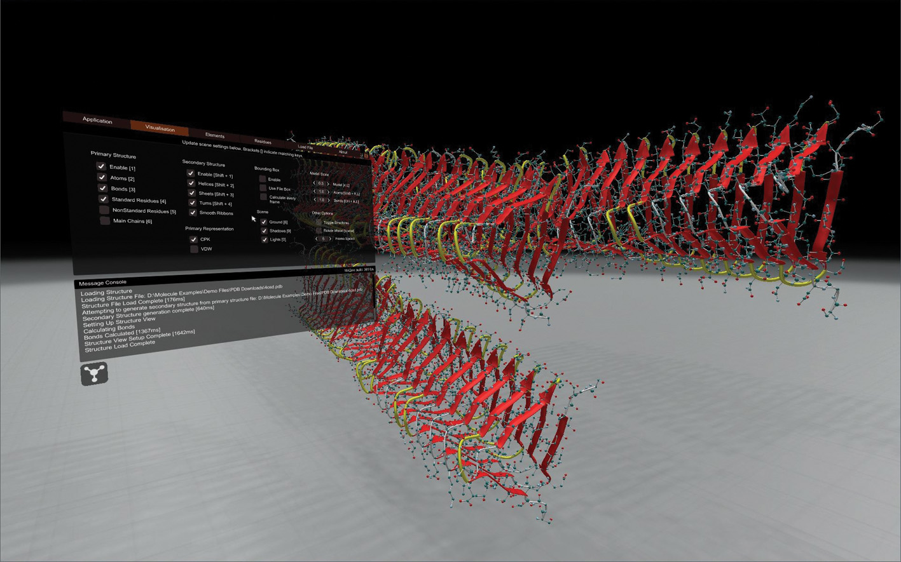

# MolecularDynamicsVisualization

Molecular Dynamics Visualization (MDV) is a tool developed by Curtin University to display molecular dynamics simulations on a large scale stereo cylindrical display at Curtin HIVE.

The application loads molecular topology and trajectory files and displays the structure and trajectory animation on screen. It supports PDB, Gromacs and XYZ files. It also allows for animation of the secondary structure. The menu is built in world space with a pointer mapped to 3D space to cater to stereo displays that don't use the OS mouse cursor.

This software was developed by the following staff at Curtin University, Michael Wiebrands, Ricardo Mancera, Chris Malajczuk, Andrew  Woods and Andrew Rohl.

### Note

This repository provides a version of MDV for Windows PC. Code specific to the Curtin HIVE Cylinder integration is not included in this repository.

### More information

https://www.youtube.com/watch?v=5SrmfuHLRbs

https://www.degruyter.com/view/j/jib.2018.15.issue-2/jib-2018-0010/jib-2018-0010.xml
