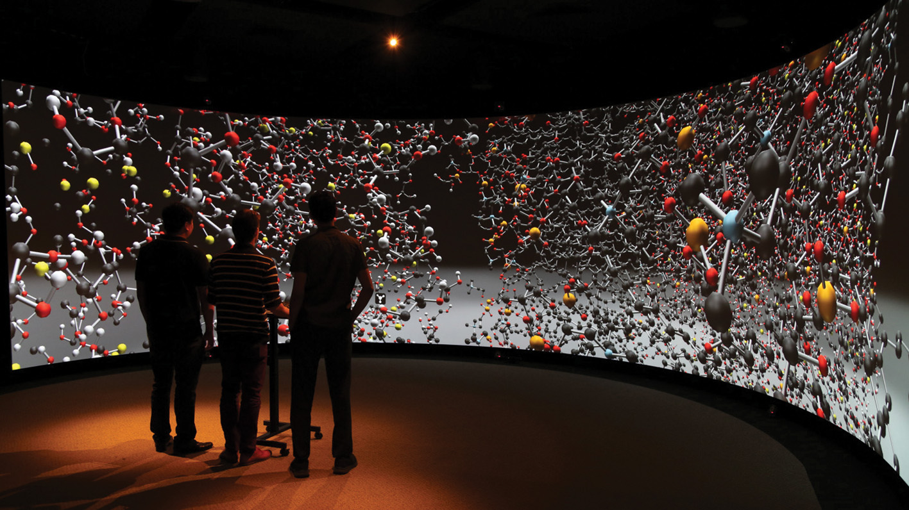

# Molecular Dynamics Visualization (MDV)

Molecular Dynamics Visualization (MDV) is a tool developed by Curtin University to display molecular dynamics simulations on a large scale stereo cylindrical display at Curtin HIVE.

**Features**
- Load and rendering of molecular topology files. Includes rendering support for
protein secondary structures. Supports PDB, Gromacs and XYZ formats.
- Load of molecular trajectory files and rendering of primary and secondary
structure animation of the trajectory. Supports XTC and DCD formats.
- Stereo capable user interface built in world space with a mouse pointer in 3D
space.
- Detailed visualisation options with support for modifying molecular
representation at both a protein residue and an atom by atom level.
- Ability to save and load visualisation settings for molecular structures.
- Load multiple molecules into the same 3D visual space and translate and
rotate molecules in relation to each other.
- Realtime calculation and visualisation of VDW energies and electrostatic
forces between pairs of moving molecules. 

This software was developed by the following staff at Curtin University, Michael Wiebrands, Ricardo Mancera, Chris Malajczuk, Andrew  Woods and Andrew Rohl.

### Note

This repository provides a version of MDV for Windows PC. Code specific to the Curtin HIVE Cylinder integration is not included in this repository.

### More information

https://doi.org/10.1515/jib-2018-0010

https://www.youtube.com/watch?v=5SrmfuHLRbs

